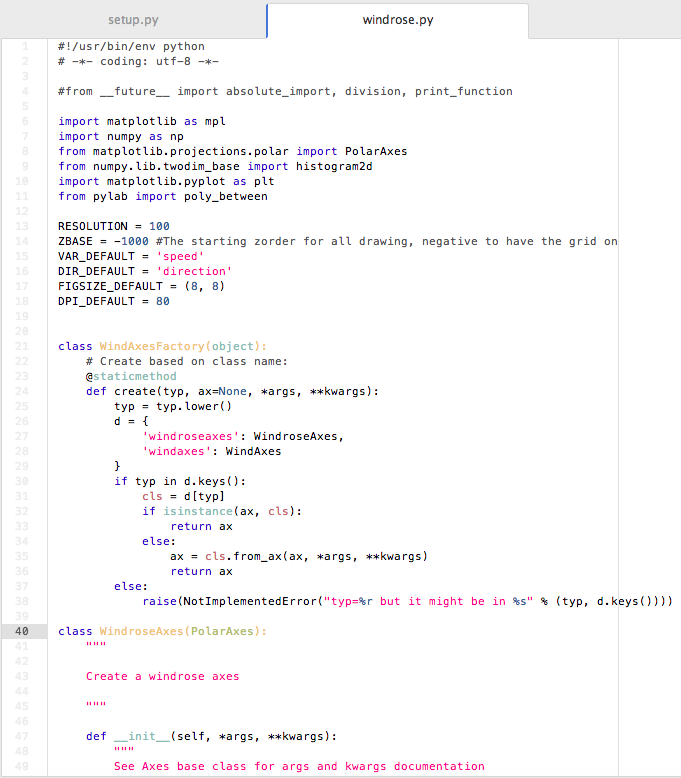

# AA Light Syntax theme

*WORK IN PROGRESS - DON'T USE IT!*

Atom AA theme.

This theme is not installed by default with Atom and can be activated by going to
the _Themes_ section in the Settings view (`cmd-,`) and selecting it from the
_Syntax Themes_ drop-down menu.

Fork from: https://github.com/atom/base16-tomorrow-light-theme
